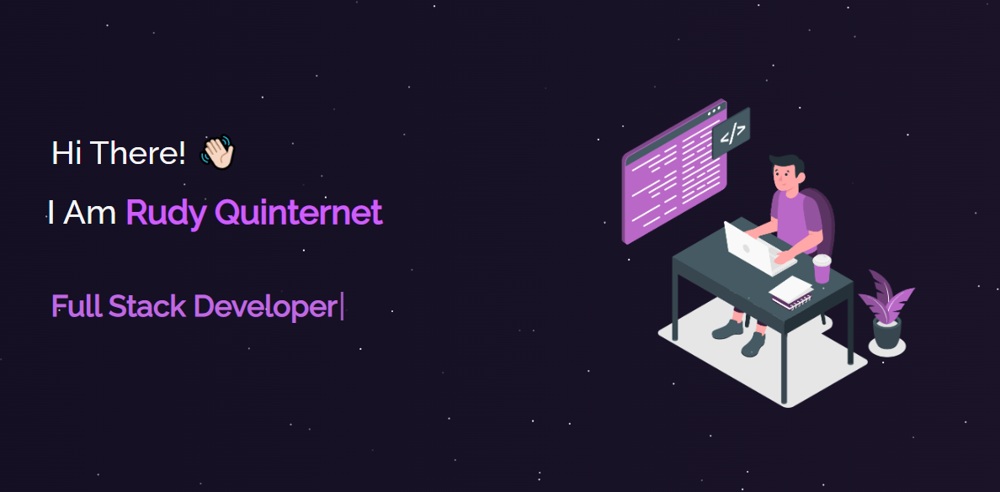

<h2 align="center">
  Description Website 
  <a href="http://rudyquinternet.com/" target="_blank">rudyquinternet.com</a>
</h2>

  

 

 &nbsp;
 &nbsp;
 &nbsp;

## Built With

My personal page <a href="http://rudyquinternet.com/" target="_blank">rudyquinternet.com</a> which features some informations about myself 

This project was built using these technologies.

- React.js
- Node.js
- Express.js
- CSS3

## Features

**📖 Multi-Page Layout**

**🎨 Styled with React-Bootstrap and Css with easy to customize colors**

**📱 Fully Responsive**

### Show your support

Give a ⭐ if you like this website!

